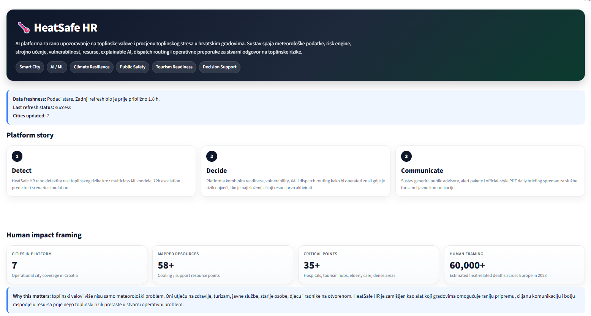
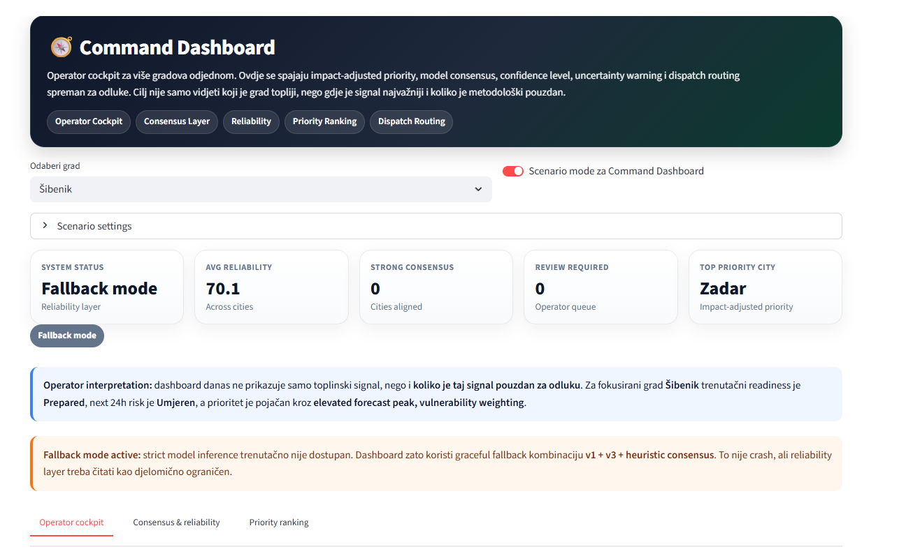
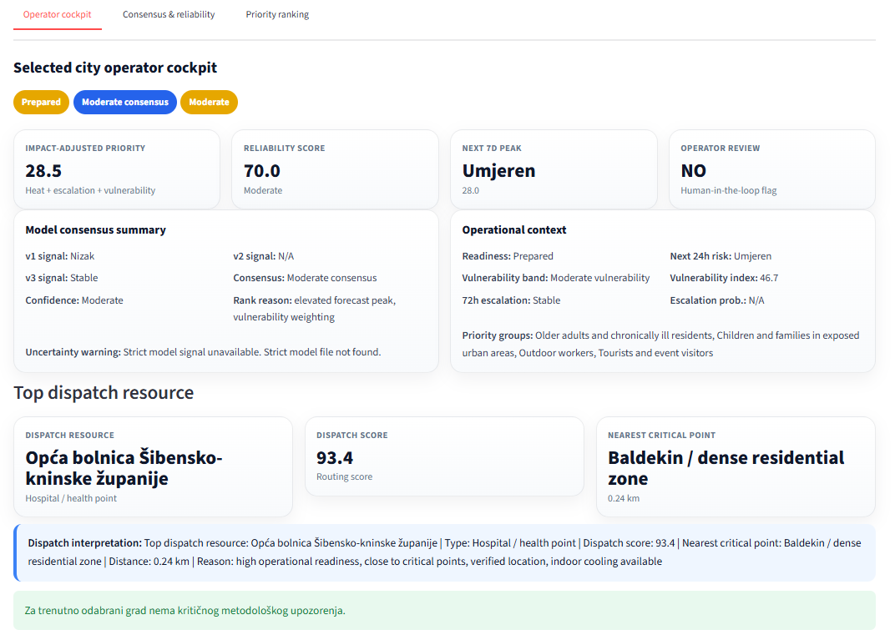
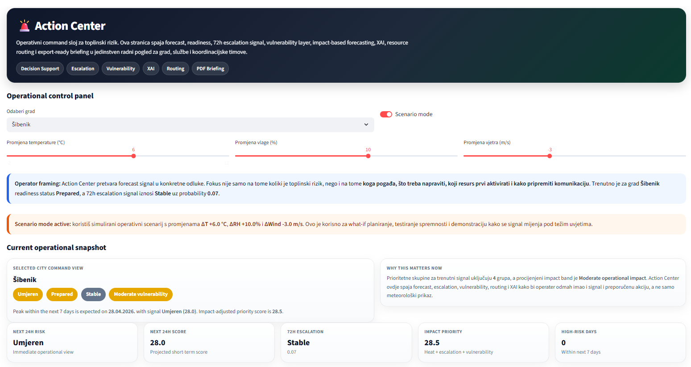
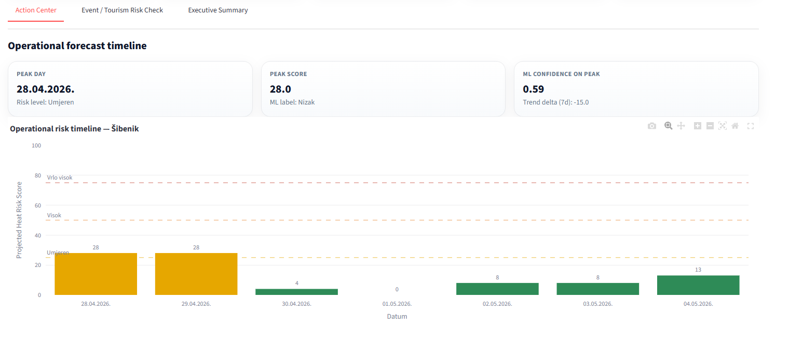
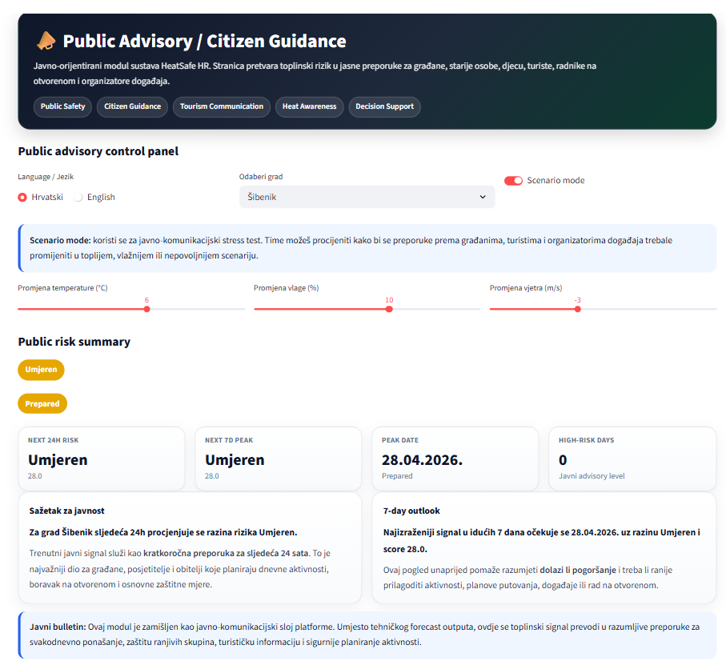
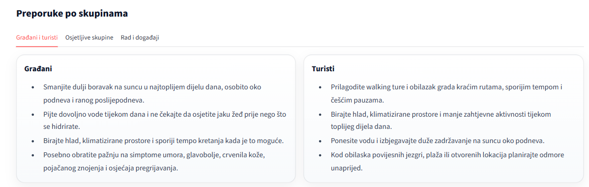

# 🧊 HeatSafe HR

**An AI/ML decision-support platform that transforms weather data into heat-risk forecasting, early warning, operational readiness, and public guidance for Croatian cities.**


---

## Overview

HeatSafe HR is a Croatian smart-city and public-safety platform built to detect, interpret, and communicate urban heat risk.

It combines meteorological forecasting, machine learning, vulnerability-aware prioritization, explainable AI, resource routing, and public advisory outputs into a single operational workflow.

Heat waves are no longer only a weather issue. They are also a public-health, civil-protection, and urban-readiness challenge. While weather forecasts provide signals, they do not answer the operational questions that matter most:

- Which city should act first?
- Which groups are most exposed?
- Is escalation likely within the next 72 hours?
- Which support point should be activated first?
- What should be communicated to the public, tourists, and city services?

HeatSafe HR was built around that gap.

This is **not just a weather dashboard**. It is an **AI/ML decision-support platform** designed for:

- cities and local government
- civil protection and emergency coordination
- health and public services
- tourism stakeholders and event organizers
- public communication teams
- citizens and visitors

Its goal is simple: turn weather data into earlier, clearer, and more actionable heat-risk response.

---

## How it works

The platform follows a three-stage operational flow.

### 1 - Detect

Meteorological data is ingested daily from Open-Meteo for seven Croatian cities.
Three ML models run in parallel to produce a current risk classification,
a strict validation signal, and a 72-hour escalation probability.

### 2 - Decide

Model outputs are combined with city-level vulnerability profiles,
resource availability, confidence and consensus checks, and SHAP-based
explainability so operators understand not just *what* the system recommends
but *why*.

### 3 - Communicate

Risk signals are translated into outputs that can be used directly:
public advisories in Croatian and English, structured alert packages for media
and SMS operators, executive-style PDF briefings ready for morning coordination
meetings, and dispatch routing recommendations with resource prioritisation.

---

## ML Model Layers

| Model layer | Best model | Type | Main metrics | Purpose |
|---|---|---|---|---|
| **v1 Production** | `random_forest` | Multiclass next-day heat-risk classifier | Accuracy **0.863**, Macro F1 **0.662**, Weighted F1 **0.863** | Operational next-day classification of heat-risk level |
| **v2 Strict** | `random_forest_strict` | Multiclass classifier under a stricter feature regime | Accuracy **0.861**, Macro F1 **0.652**, Weighted F1 **0.861** | Methodologically stricter validation without relying on shortcut risk-score features |
| **v3 Escalation** | `extra_trees_escalation` | Binary 72h escalation early-warning classifier | Accuracy **0.949**, Positive F1 **0.780**, ROC AUC **0.981** | Predict whether a city is likely to escalate within the next 72 hours |

### Why three model layers?

- **v1** delivers operational value.
- **v2** strengthens research credibility.
- **v3** adds early-warning capability for alerting and readiness planning.

---

## Key Features

- **7-day operational forecast**  
  Converts forecast weather into projected heat-risk score, risk level, readiness framing, and ML signal.

- **72h early-warning escalation**  
  Predicts whether a city is likely to move toward a worse heat-risk posture within the next 72 hours.

- **Vulnerability-aware prioritization**  
  Adjusts operational priority using city vulnerability profiles rather than temperature alone.

- **Dispatch routing**  
  Recommends which cooling, support, or emergency resource should be activated first based on readiness, proximity, trust, and relevance.

- **XAI / SHAP explainability**  
  Shows why the escalation model produced its signal, including top positive and protective drivers.

- **PDF daily briefing**  
  Generates export-ready daily briefing documents for city operators and civil-protection workflows.

- **Stress test simulator**  
  Runs what-if scenarios with hotter, more humid, and lower-wind conditions plus synthetic operational stress.

- **Public advisory (HR / EN)**  
  Produces audience-specific recommendations for citizens, elderly people, children, tourists, outdoor workers, and event organizers.

- **Alert Center**  
  Converts forecast and escalation signals into alert severity, history logs, communication outputs, and operator packages.

- **Historical replay**  
  Replays historical periods to show what the platform would have recommended during past heat episodes.

- **Event / tourism risk check**  
  Estimates event-level operational risk from day, time slot, attendance, and vulnerable-group assumptions.

- **Methodology / insights layer**  
  Includes confusion matrices, feature importance, threshold tuning, false-positive / false-negative analysis, and live XAI views.

---

## Platform Preview

### Home


Main landing page of the platform, introducing HeatSafe HR as an AI/ML decision-support system for heat-risk monitoring, public safety, and city-level operational readiness.

### Command Dashboard



Multi-city operator cockpit for ranking Croatian cities by heat risk, readiness status, escalation probability, model reliability, and impact-adjusted priority across Croatian urban contexts.

### Action Center



Operational decision layer that combines forecast signals, vulnerability context, escalation logic, sector actions, dispatch routing, explainable AI, event-risk evaluation, and export-ready briefing outputs.

### Public Advisory



Public-facing communication layer that translates model output into clear, actionable recommendations for citizens, tourists, vulnerable groups, outdoor workers, and event organizers in both Croatian and English.

---

## City Coverage

HeatSafe HR currently covers **7 Croatian cities**:

| City | Why it was included |
|---|---|
| **Zagreb** | Capital-city context with high urban exposure and strong public-service relevance |
| **Split** | Large Adriatic city with intense summer heat and strong tourism pressure |
| **Rijeka** | Northern Adriatic city with a distinct coastal climate profile |
| **Osijek** | Inland eastern-city context useful for contrast against coastal behavior |
| **Dubrovnik** | High tourism intensity and strong public-communication relevance |
| **Zadar** | Coastal mid-size city with significant seasonal visitor load |
| **Šibenik** | Mixed residential-tourism coastal context useful for operational scenario testing |

These cities were selected to provide a useful mix of:

- coastal and inland exposure
- tourism-heavy and non-tourism contexts
- capital, regional, and mid-size urban environments

---

## Tech Stack

| Technology | Purpose |
|---|---|
| **Python** | Core language for data pipelines, ML, and business logic |
| **Streamlit** | Multi-page web application and operator-facing interface |
| **pandas** | Data wrangling, feature tables, reporting, and exports |
| **scikit-learn** | Model training, inference, evaluation, and threshold tuning |
| **SHAP** | Explainable AI for local escalation-model interpretation |
| **Plotly** | Interactive charts and analytical visualizations |
| **ReportLab** | PDF daily briefing generation |
| **Open-Meteo** | Historical and forecast weather data source |
| **CSV resource layers** | Cooling centers, critical points, vulnerability profiles, and city metadata |

---

## Project Structure

```text
HEATSAFE-HR/
├── app/
│   ├── Home.py
│   ├── assets/
│   │   └── cities/
│   └── pages/
│       ├── 1_Overview.py
│       ├── 2_History.py
│       ├── 3_Insights.py
│       ├── 4_Forecast.py
│       ├── 5_Action_Center.py
│       ├── 6_Command_Dashboard.py
│       ├── 7_Methodology_Research.py
│       ├── 8_Public_Advisory.py
│       ├── 9_Resources_Map.py
│       ├── 10_Alert_Center.py
│       ├── 11_Historical_Replay.py
│       └── 12_Stress_Test.py
│
├── data/
│   ├── alerts/
│   │   └── alert_history.csv
│   ├── models/
│   │   ├── best_next_day_risk_model.joblib
│   │   ├── best_next_day_risk_model_strict.joblib
│   │   ├── best_escalation_72h_model.joblib
│   │   ├── model_metrics.json
│   │   ├── model_metrics_strict.json
│   │   ├── model_metrics_escalation.json
│   │   └── test_predictions_*.csv
│   ├── processed/
│   │   ├── all_cities_daily.csv
│   │   ├── all_cities_daily_with_risk.csv
│   │   ├── all_cities_features.csv
│   │   └── city-level processed datasets
│   ├── raw/
│   │   └── open_meteo/
│   │       └── hourly historical weather CSVs
│   ├── resources/
│   │   ├── city_vulnerability_profiles.csv
│   │   ├── cooling_centers.csv
│   │   └── critical_points.csv
│   └── status/
│       ├── refresh_status.json
│       └── refresh_audit_log.json
│
├── outputs/
│   ├── briefings/
│   ├── model_analysis/
│   ├── model_analysis_strict/
│   └── model_analysis_escalation/
│
├── src/
│   ├── alert_engine.py
│   ├── communication_engine.py
│   ├── config.py
│   ├── data_ingestion.py
│   ├── decision_engine.py
│   ├── escalation_engine.py
│   ├── feature_engineering.py
│   ├── forecast_engine.py
│   ├── impact_engine.py
│   ├── model_analysis.py
│   ├── model_analysis_strict.py
│   ├── model_analysis_escalation.py
│   ├── pdf_export_engine.py
│   ├── predict.py
│   ├── preprocessing.py
│   ├── reliability_engine.py
│   ├── resource_recommender.py
│   ├── resource_routing_engine.py
│   ├── risk_engine.py
│   ├── sidebar.py
│   ├── train_model.py
│   ├── train_model_strict.py
│   ├── train_escalation_model.py
│   ├── tune_escalation_thresholds.py
│   ├── update_live_data.py
│   ├── utils.py
│   ├── vulnerability_engine.py
│   └── xai_engine.py
│
├── tests/
├── requirements.txt
└── README.md
```

### Structure Notes

- `app/` contains the Streamlit application.
- `src/` contains the platform logic, ML layers, decision support, routing, XAI, and export engines.
- `data/` contains raw data, processed features, models, resources, and operational status files.
- `outputs/` stores analysis artifacts and generated briefings.

---

## Getting Started

### 1. Clone the repository

```bash
git clone <your-repository-url>
cd HEATSAFE-HR
```

### 2. Create and activate a virtual environment

**Windows**

```bash
python -m venv .venv
.venv\Scripts\activate
```

**macOS / Linux**

```bash
python -m venv .venv
source .venv/bin/activate
```

### 3. Install dependencies

```bash
pip install -r requirements.txt
```

### 4. Run the Streamlit app

From the repository root, start the application with:

```bash
streamlit run app/Home.py
```

### 5. Open in the browser

Streamlit usually opens automatically. If it does not, open:

```text
http://localhost:8501
```

### Important run notes

- Run the app from the project root, not from inside `app/`, `app/pages/`, or `src/`.
- The main entry point of the application is `app/Home.py`.
- All additional dashboard pages are located in `app/pages/`.
- Do not launch individual pages directly with Streamlit.
- Always start the app through `app/Home.py` so the full multi-page navigation works correctly.

### Required project data

The application expects the repository structure and data files to remain in place, especially:

```text
data/processed/
data/models/
data/resources/
data/status/
outputs/
src/
app/
```

In particular, the app depends on pre-generated files such as:

- `data/processed/all_cities_daily_with_risk.csv`
- model metric files in `data/models/`
- resource and vulnerability CSV files in `data/resources/`

If these files are missing, some modules may not load correctly.

### Live refresh note

The Home page includes an operational **Refresh data** action. That workflow uses the project's live update pipeline and may require internet access for weather-source refresh operations.

If you only want to review the platform locally with the bundled data, simply run:

```bash
streamlit run app/Home.py
```

without triggering refresh.

### Recommended local workflow

```bash
git clone <your-repository-url>
cd HEATSAFE-HR
python -m venv .venv
# Windows
.venv\Scripts\activate
# macOS / Linux
# source .venv/bin/activate
pip install -r requirements.txt
streamlit run app/Home.py
```

---

## Data Sources

### Open-Meteo

HeatSafe HR uses **Open-Meteo** as the main source of historical and forecast meteorological data. This keeps the platform reproducible, transparent, and easy to run without proprietary APIs.

### Internal project resource layers

The platform also uses project-owned CSV layers for:

- cooling centers
- critical points
- city vulnerability profiles

These are used for:

- routing logic
- vulnerability-aware prioritization
- human-impact framing
- resource recommendation
- executive briefing generation

### Important note

Some operational fields such as capacity, trust, opening suitability, and recommendation scores are project-layer estimates, not live telemetry.

HeatSafe HR should therefore be interpreted as a **decision-support platform / prototype**, not as a live emergency-dispatch backend.

---

## Competition Context

HeatSafe HR was developed as an academic and competition-ready project aligned with **Student Digi Awards 2026**, a Croatian competition focused on digital transformation, AI, health, smart cities, sustainability, mobility, safety, education, tourism, and socially relevant innovation.

This context matters because Student Digi Awards has already highlighted projects with clear human impact, such as:

- **AISight** — an accessibility-focused AI solution for blind and visually impaired users
- **SkyResQ** — a drone-enabled emergency medical delivery system
- **Tongueo** — a digital communication tool for people with aphasia

HeatSafe HR belongs in that same space:

- applied AI/ML
- visible societal value
- clear practical workflow
- human-centered problem solving
- a real interface rather than only a technical prototype

---

## Human Impact

### Platform footprint

- **7 Croatian cities**
- **58+ mapped resources**
- **35+ critical points**
- **3 ML model layers**
- public, operator, and civil-protection outputs in one workflow

### Why this matters

Extreme heat is already one of Europe's most serious climate-health risks.

HeatSafe HR is built around a simple operational idea:

> Heat risk becomes much more dangerous when cities can see the weather but cannot translate it into action.

The platform aims to reduce that gap by supporting:

- earlier interpretation
- better prioritization
- more targeted communication
- stronger readiness planning
- more useful routing toward support resources

---

## Author & Acknowledgements

**Author:** `Angelo Miletic`

HeatSafe HR was built as an academic, research, and competition-focused project centered on applied AI/ML for public safety, climate resilience, operational decision support, and heat-risk communication.

### Acknowledgements

- Open-Meteo for accessible meteorological data
- the wider scientific community working on heat-health risk in Europe
- the Student Digi Awards ecosystem for promoting practical, human-centered innovation

---

## License

MIT License — see [LICENSE](LICENSE) for details.

© 2026 Angelo Miletić
